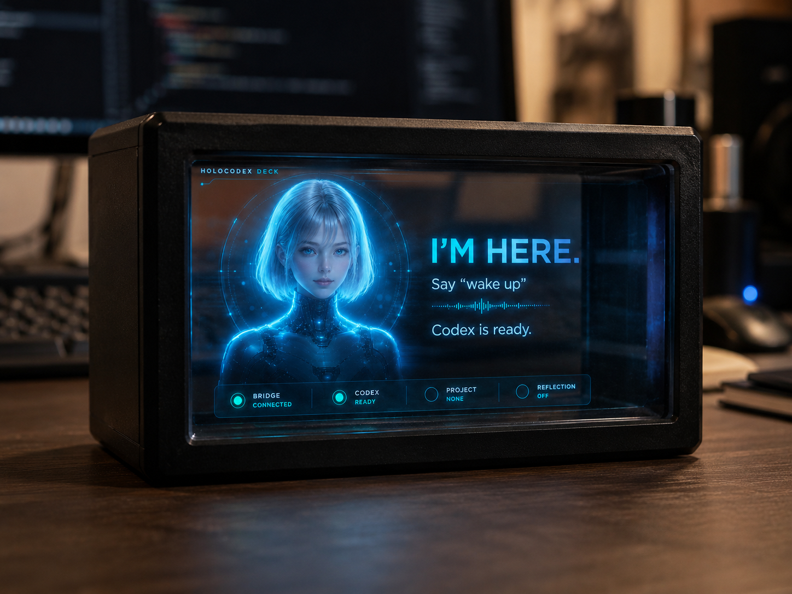

# HoloUI

**A holographic voice cockpit for coding agents.**

HoloUI turns your phone into a small cyberpunk control deck for your agents.

Put the phone into a HoloBox, say “wake up”, speak a task, and watch Codex move through listening, running, approval, and result states.

Work should be useful.
Work should be safe.
Work should also feel a little rock’n’roll.

---

## What is HoloUI?

HoloUI is a local-first voice/avatar interface for supervising coding agents from a phone-based holographic display.

It is not an IDE.
It is not a model.
It is not a generic dashboard.
It is not a replacement for Codex.

It is a **holographic control layer** for local agent work.

Current real runner:

```text
Codex CLI
```

Future adapter directions:

```text
Claude Code
Codex App Server / SDK
Other local CLI agents
```

---

## Why it exists

Coding agents are powerful, but background work is easy to lose track of.

You need to know what is running, what needs approval, what failed, what completed, which project is active, and what to say next.

Usually that means more tabs, logs, dashboards, terminals, and mental clutter.

HoloUI tries a different idea:

> Your coding agent should feel present, visible, controllable, and fun to work with.

A small holographic cockpit on your desk.
A voice-first assistant.
A clear state machine.
No mystery background magic.

Just enough future to make coding feel alive.

---

## Who it is for

HoloUI is for:

* developers using Codex CLI or local coding agents;
* AI-native builders running background agent tasks;
* makers experimenting with physical AI interfaces;
* people who want a visible agent companion outside the IDE;
* teams exploring approval, review, and multi-agent supervision flows.

---

## What is a HoloBox?

A **HoloBox** is a small physical box for a phone, based on the Pepper’s Ghost reflection effect.

The phone lies horizontally inside the box.
An angled transparent plate reflects the phone screen.
The result looks like a small floating holographic interface.

You can 3D print the body and start with simple clear plastic or acrylic for early tests.

Reference model:

```text
Hologram Box for Smartphones
https://makerworld.com/en/models/716763-hologram-box-for-smartphones
```

For a cleaner result, use **teleprompter / beam splitter glass** instead of ordinary plastic.

For this prototype we are targeting **50/50 teleprompter glass**:

```text
50% transmission
50% reflection
```

---

## How it works

1. Run HoloUI locally on your Mac.
2. Open `/hologram` on your phone.
3. Place the phone in the HoloBox.
4. Say “wake up”.
5. Pick a project or continue the current context.
6. Speak a task.
7. Confirm before it reaches Codex.
8. Codex runs locally.
9. HoloUI shows progress, approvals, and results.
10. Use `/dashboard` only when you need deeper diagnostics.

---

## Core HoloBox experience

The hologram UI is built around 8 compact states:

| State                 | Purpose                                       |
| --------------------- | --------------------------------------------- |
| WakeUp                | The assistant is present and ready            |
| Project / Chat Picker | Choose where the next task goes               |
| Chat Context          | See project, source, branch, and last message |
| Listening             | Speak the task or say “cancel”                |
| Confirm               | Review before sending to Codex                |
| Running               | Watch the agent work                          |
| Approval              | Approve or decline a requested action         |
| Result                | See files, tests, summary, and next actions   |

---

## HoloBox vs Dashboard

HoloUI has two surfaces:

| Surface           | Purpose                                    |
| ----------------- | ------------------------------------------ |
| `/hologram`       | Phone/HoloBox voice cockpit                |
| `/hologram/debug` | Preview all 8 hologram states              |
| `/dashboard`      | Technical diagnostics, logs, health, tasks |

The HoloBox UI is intentionally minimal.

It should feel like a living assistant, not a dense admin panel.

The dashboard is for debugging.
The HoloBox is for presence.

---

## What works now

Current MVP capabilities:

* phone-oriented `/hologram` interface;
* 8-state voice/avatar HoloBox UX;
* `/hologram/debug` state preview;
* `/dashboard` diagnostics surface;
* Web Speech API voice capture;
* manual text fallback;
* explicit confirmation before sending a task;
* `cancel` flow during listening;
* real Codex CLI runner v1;
* streamed task logs/events;
* Git safety checks for real Codex runs;
* configured test command execution;
* optional local token for LAN testing;
* local-first Next.js app.

---

## Quickstart

### Install

```bash
npm install
```

### Configure

Create local config from the project example.

Typical config includes:

* project name;
* project path;
* runner mode;
* Codex CLI command;
* test command;
* optional LAN token.

Do not commit local config files.

### Run

```bash
npm run dev
```

Example local URL:

```text
http://localhost:8787
```

### Open HoloBox UI

On Mac:

```text
http://localhost:8787/hologram
```

On phone in the same local network:

```text
http://<your-mac-lan-ip>:8787/hologram
```

Debug all states:

```text
http://localhost:8787/hologram/debug
```

Health check:

```text
http://localhost:8787/api/health
```

---

## Routes

| Route             | Purpose                      |
| ----------------- | ---------------------------- |
| `/hologram`       | Main phone/HoloBox interface |
| `/hologram/debug` | Preview all 8 states         |
| `/dashboard`      | Technical dashboard          |
| `/api/health`     | Runtime health               |
| `/api/tasks`      | Task API                     |

---

## What is real vs future

### Real now

* local Next.js app;
* `/hologram` 8-state UI;
* Web Speech confirmation flow;
* manual input fallback;
* real Codex CLI runner v1;
* Git safety checks;
* configured test command execution;
* streamed task events/logs;
* local health endpoint.

### Partial / prototype layer

* project/chat picker uses configured project and demo/in-memory context;
* background notifications have model/render support but are not full orchestration yet;
* task/session persistence is not production-ready yet;
* hardware readability still needs real HoloBox QA;
* voice navigation is not a complete natural-language command system yet.

### Not implemented yet

* persistent task/session database;
* production auth and pairing;
* production-grade LAN security;
* real multi-agent orchestration;
* native iOS app;
* App Store distribution;
* Claude Code adapter;
* Codex App Server adapter;
* cloud deployment.

---

## Security

HoloUI is a local developer tool.

Do not expose it to the public internet.

It can trigger local agent actions in your project directory. Treat it as a tool with access to your codebase.

Recommendations:

* use only on trusted local networks;
* enable a local token for LAN testing;
* do not publish the server publicly;
* review Git changes before committing;
* do not point it at sensitive repositories unless you understand the runner behavior.

---

## Development checks

Run before pushing:

```bash
npm run typecheck
npm run lint
npm test
npm run build
```

---

## Media assets

Current product hero:

```text
docs/assets/hero-holoui.png
```

Recommended future assets:

```text
docs/assets/holoui-demo.gif
docs/assets/holoui-8-states.png
docs/assets/holobox-setup.jpg
```

Do not reference files that do not exist yet, or GitHub will show broken images.

---

## Roadmap

Near-term:

* real HoloBox / iPhone visual QA;
* better reflection readability;
* persistent task/session storage;
* real project/chat history;
* better voice command navigation;
* real background task notifications;
* README media assets.

Later:

* production phone ↔ Mac pairing/auth;
* PWA or iOS companion exploration;
* richer approval flow;
* better diff/result handoff;
* Codex App Server / SDK adapter exploration;
* Claude Code adapter exploration;
* multi-agent supervision;
* public demo video;
* product landing page.

---

## Project status

HoloUI is an experimental local-first MVP.

It is already useful as a prototype for:

* voice-first agent control;
* phone-based holographic UI;
* Codex CLI task execution;
* Git-safe local agent runs;
* HoloBox state design.

It is not yet a production-ready mobile app, hosted service, or secure team deployment.

---

## Naming

**HoloUI** — project/product name.
**HoloBox** — a small holographic / Pepper’s Ghost box for a phone.
**Hologram UI** — the phone interface reflected inside the HoloBox.
**Codex CLI** — the current real coding-agent runner.
**Dashboard** — the technical diagnostics surface, separate from the HoloBox UI.

---

## License

License TBD.
